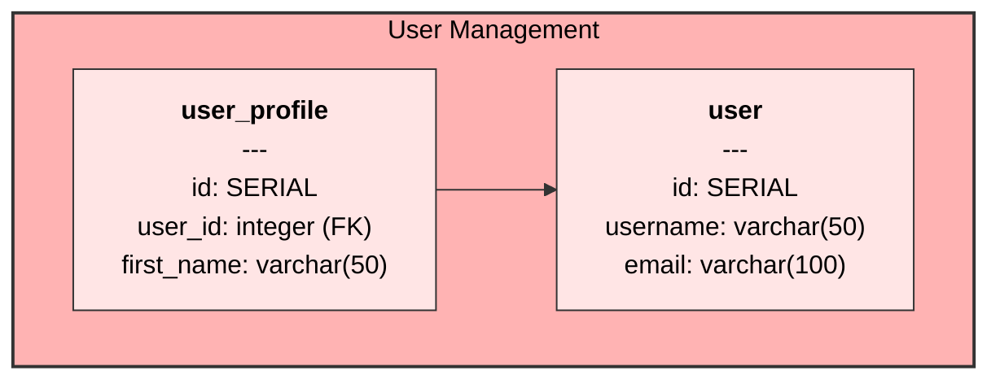

# DURC Diagram Generator

A standalone Python script that generates Mermaid diagrams from CREATE TABLE SQL statements, following DURC (Database-Unified Relational CRUD) naming conventions.

## Features

- **Standalone**: No Django dependency - runs as a pure Python script
- **SQL Parsing**: Extracts table structures from CREATE TABLE statements
- **DURC Conventions**: Automatically detects foreign key relationships using `_id` naming convention
- **Diagram Sections**: Groups tables into colored sections based on `-- Diagram Section:` comments
- **Styled Output**: Generates Mermaid flowchart diagrams with light pastel colors
- **Relationship Detection**: Shows foreign key relationships between tables
- **Source Tracking**: Lists source SQL files at the bottom of generated markdown

## Usage

```bash
python3 durc_diagram.py --sql_files file1.sql file2.sql --output_md_file diagram.md
```

### Arguments

- `--sql_files`: One or more SQL files to parse (required)
- `--output_md_file`: Output markdown file path (required)

### Example

```bash
# Generate diagram from multiple SQL files
python3 durc_diagram.py \
  --sql_files schema1.sql schema2.sql \
  --output_md_file database_diagram.md
```

## Diagram Sections

To group tables into sections, add comments before CREATE TABLE statements:

```sql
-- Diagram Section: User Management
CREATE TABLE user (
  id SERIAL PRIMARY KEY,
  username varchar(50) NOT NULL,
  email varchar(100) NOT NULL
);

-- Diagram Section: User Management
CREATE TABLE user_profile (
  id SERIAL PRIMARY KEY,
  user_id integer NOT NULL,  -- This creates a foreign key relationship
  first_name varchar(50)
);
```

## DURC Naming Conventions

The script follows DURC naming conventions:

- **Foreign Keys**: Columns ending with `_id` are treated as foreign keys
- **Table References**: `user_id` automatically links to the `user` table
- **Pattern Matching**: `prefix_table_id` links to the `table` table
- **Ignored Tables**: Tables starting with `_` or containing "ignore" are skipped

## Output Format

The generated markdown file contains:

1. **Mermaid Diagram**: Flowchart with styled tables and relationships
2. **Colored Sections**: Tables grouped by diagram sections with matching colors
3. **Table Details**: All columns listed in CREATE TABLE order
4. **Foreign Key Indicators**: FK notation for foreign key columns
5. **Source Files**: Ordered list of input SQL files

## Styling

- **Table Colors**: Light pastel backgrounds for readability
- **Section Colors**: Darker pastel backgrounds for section grouping
- **Relationships**: Arrows showing foreign key connections
- **Typography**: Bold table names, clear column listings

### Formatting Specifics

- **Font Sizes**: Table names are two sizes larger than column text (16px vs 12px)
- **Section Labels**: Two sizes larger than table names (20px) with bold styling
- **Column Alignment**: Column names are left-aligned, data types are right-aligned
- **Automatic Width Adjustment**: Tables automatically adjust width to accommodate long column names
- **Consistent Spacing**: Minimum 3 spaces between column names and data types
- **Monospace Font**: Uses monospace font family for consistent column alignment
- **HTML Styling**: Uses HTML spans and divs for precise formatting control
- **Professional Layout**: Consistent spacing and typography throughout

## Requirements

- Python 3.6+
- No external dependencies (uses only standard library)

## Example Output

The script generates Mermaid diagrams like this:



This creates a visually appealing database schema diagram with proper relationships and groupings.
