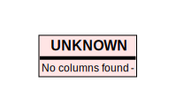

# Database Schema Diagram (Graphviz Implementation)

## Source Files

1. [test_with_sections.sql](test_with_sections.sql)

## Implementation Details

This diagram was generated using:
- **SQL Parser**: sqlglot library for robust SQL parsing
- **Diagram Engine**: Python graphviz library with HTML table styling
- **Table Styling**: HTML tables with two columns (field name, field type)
- **Sections**: Grouped tables with colored backgrounds based on diagram section comments
- **Relationships**: Foreign key relationships shown as directed edges
