# Database Schema Diagram

```mermaid
flowchart TD
    author["<b>author</b><br/>---<br/>id: SERIAL<br/>lastname: varchar(255)<br/>firstname: varchar(255)<br/>created_date: timestamp<br/>updated_date: timestamp"]
    style author fill:#FFE5E5,stroke:#333,stroke-width:1px,color:#000
    author_book["<b>author_book</b><br/>---<br/>id: SERIAL<br/>author_id: integer (FK)<br/>book_id: integer (FK)<br/>authortype_id: integer (FK)"]
    style author_book fill:#FFE5E5,stroke:#333,stroke-width:1px,color:#000
    authortype["<b>authortype</b><br/>---<br/>id: SERIAL<br/>authortypedesc: varchar(255)<br/>created_at: timestamp<br/>updated_at: timestamp"]
    style authortype fill:#FFE5E5,stroke:#333,stroke-width:1px,color:#000
    book["<b>book</b><br/>---<br/>id: SERIAL<br/>title: varchar(255)<br/>release_date: timestamp<br/>created_at: timestamp<br/>updated_at: timestamp"]
    style book fill:#FFE5E5,stroke:#333,stroke-width:1px,color:#000
    characterTest["<b>characterTest</b><br/>---<br/>id: SERIAL<br/>funny_character_field: varchar(1000)"]
    style characterTest fill:#FFE5E5,stroke:#333,stroke-width:1px,color:#000
    comment["<b>comment</b><br/>---<br/>id: SERIAL<br/>comment_text: varchar(1000)<br/>post_id: integer (FK)<br/>created_at: timestamp<br/>updated_at: timestamp"]
    style comment fill:#FFE5E5,stroke:#333,stroke-width:1px,color:#000
    filterTest["<b>filterTest</b><br/>---<br/>id: SERIAL<br/>test_url: varchar(1000)<br/>test_json: text<br/>created_at: timestamp<br/>updated_at: timestamp"]
    style filterTest fill:#FFE5E5,stroke:#333,stroke-width:1px,color:#000
    foreignkeytestgizmo["<b>foreignkeytestgizmo</b><br/>---<br/>id: SERIAL<br/>gizmoname: varchar(100)<br/>created_at: timestamp<br/>updated_at: timestamp<br/>deleted_at: timestamp"]
    style foreignkeytestgizmo fill:#FFE5E5,stroke:#333,stroke-width:1px,color:#000
    foreignkeytestthingy["<b>foreignkeytestthingy</b><br/>---<br/>id: SERIAL<br/>thingyname: varchar(100)<br/>gizmopickupaskey: integer<br/>created_at: timestamp<br/>updated_at: timestamp<br/>deleted_at: timestamp"]
    style foreignkeytestthingy fill:#FFE5E5,stroke:#333,stroke-width:1px,color:#000
    funnything["<b>funnything</b><br/>---<br/>id: SERIAL<br/>thisint: integer<br/>thisfloat: float<br/>thisdecimal: decimal(5,5)<br/>thisvarchar: varchar(100)<br/>thisdate: date<br/>thisdatetime: timestamp<br/>thistimestamp: timestamp<br/>thischar: char(1)<br/>thistext: text<br/>thisblob: bytea<br/>thistinyint: smallint<br/>thistinytext: text"]
    style funnything fill:#FFE5E5,stroke:#333,stroke-width:1px,color:#000
    graphdata_nodetypetests["<b>graphdata_nodetypetests</b><br/>---<br/>source_id: varchar(50) (FK)<br/>source_name: varchar(190)<br/>source_size: integer<br/>source_type: varchar(190)<br/>source_group: varchar(190)<br/>source_longitude: decimal(17,7)<br/>source_latitude: decimal(17,7)<br/>source_img: varchar(190)<br/>target_id: varchar(50) (FK)<br/>target_name: varchar(190)<br/>target_size: integer<br/>target_type: varchar(190)<br/>target_group: varchar(190)<br/>target_longitude: decimal(17,7)<br/>target_latitude: decimal(17,7)<br/>target_img: varchar(190)<br/>weight: integer<br/>link_type: varchar(190)<br/>query_num: integer"]
    style graphdata_nodetypetests fill:#FFE5E5,stroke:#333,stroke-width:1px,color:#000
    magicField["<b>magicField</b><br/>---<br/>id: SERIAL<br/>editsome_markdown: varchar(2000)<br/>typesome_sql_code: varchar(2000)<br/>typesome_php_code: text<br/>typesome_python_code: text<br/>typesome_javascript_code: varchar(3000)<br/>this_datetime: timestamp<br/>this_date: date<br/>created_at: timestamp<br/>updated_at: timestamp<br/>deleted_at: timestamp"]
    style magicField fill:#FFE5E5,stroke:#333,stroke-width:1px,color:#000
    post["<b>post</b><br/>---<br/>id: SERIAL<br/>title: varchar(100)<br/>content: varchar(1000)<br/>created_at: timestamp<br/>updated_at: timestamp"]
    style post fill:#FFE5E5,stroke:#333,stroke-width:1px,color:#000
    sibling["<b>sibling</b><br/>---<br/>id: SERIAL<br/>siblingname: varchar(255)<br/>step_sibling_id: integer (FK)<br/>sibling_id: integer (FK)<br/>created_at: timestamp<br/>updated_at: timestamp"]
    style sibling fill:#FFE5E5,stroke:#333,stroke-width:1px,color:#000
    tags_report["<b>tags_report</b><br/>---<br/>id: BIGSERIAL<br/>field_to_bold_in_report_display: varchar(255)<br/>field_to_hide_by_default: varchar(255)<br/>field_to_italic_in_report_display: varchar(255)<br/>field_to_right_align_in_report: varchar(255)<br/>field_to_bolditalic_in_report_display: varchar(255)<br/>numeric_field: integer<br/>decimal_field: decimal(10,4)<br/>currency_field: varchar(255)<br/>percent_field: integer<br/>url_field: varchar(255)<br/>time_field: time<br/>date_field: date<br/>datetime_field: timestamp"]
    style tags_report fill:#FFE5E5,stroke:#333,stroke-width:1px,color:#000
    test_boolean["<b>test_boolean</b><br/>---<br/>id: SERIAL<br/>label: varchar(255)<br/>is_something: varchar(255)<br/>has_something: varchar(255)<br/>is_something2: smallint<br/>has_something2: smallint<br/>has_something3: boolean"]
    style test_boolean fill:#FFE5E5,stroke:#333,stroke-width:1px,color:#000
    test_created_only["<b>test_created_only</b><br/>---<br/>id: SERIAL<br/>name: varchar(255)<br/>created_at: timestamp"]
    style test_created_only fill:#FFE5E5,stroke:#333,stroke-width:1px,color:#000
    test_default_date["<b>test_default_date</b><br/>---<br/>id: integer<br/>datetime_none: timestamp<br/>date_none: date<br/>datetime_current: timestamp<br/>date_current: varchar(255)<br/>datetime_null: timestamp<br/>date_null: date<br/>datetime_defined: timestamp<br/>date_defined: date"]
    style test_default_date fill:#FFE5E5,stroke:#333,stroke-width:1px,color:#000
    test_null_default["<b>test_null_default</b><br/>---<br/>id: SERIAL<br/>null_var: varchar(255)<br/>non_null_var_def: varchar(255)<br/>non_null_var_no_def: varchar(255)<br/>nullable_w_default: varchar(255)<br/>non_null_default: varchar(255)"]
    style test_null_default fill:#FFE5E5,stroke:#333,stroke-width:1px,color:#000
    vote["<b>vote</b><br/>---<br/>id: SERIAL<br/>post_id: integer (FK)<br/>votenum: varchar(11)<br/>updated_at: timestamp<br/>created_at: timestamp"]
    style vote fill:#FFE5E5,stroke:#333,stroke-width:1px,color:#000
    author_book --> author
    author_book --> book
    author_book --> authortype
    comment --> post
    sibling --> sibling
    sibling --> sibling
    vote --> post
```

## Source Files

1. [DURC_aaa.postgres.sql](/Users/ftrotter/gitgov/ftrotter/durc_is_crud/AI_Instructions/durc_postgres_test_files/DURC_aaa.postgres.sql)
2. [DURC_bbb.postgres.sql](/Users/ftrotter/gitgov/ftrotter/durc_is_crud/AI_Instructions/durc_postgres_test_files/DURC_bbb.postgres.sql)
