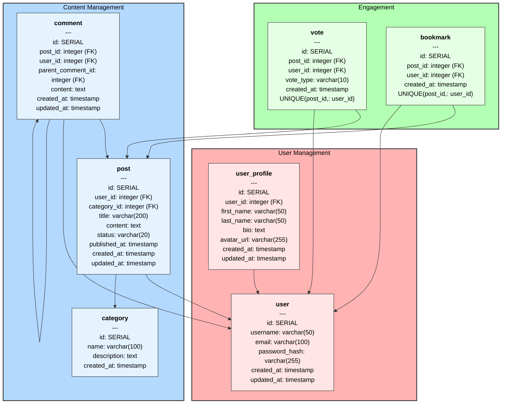

# Database Schema Diagram

```mermaid
flowchart TD
    subgraph section_0["User Management"]
        user["<b>user</b><br/>---<br/>id: SERIAL<br/>username: varchar(50)<br/>email: varchar(100)<br/>password_hash: varchar(255)<br/>created_at: timestamp<br/>updated_at: timestamp"]
        user_profile["<b>user_profile</b><br/>---<br/>id: SERIAL<br/>user_id: integer (FK)<br/>first_name: varchar(50)<br/>last_name: varchar(50)<br/>bio: text<br/>avatar_url: varchar(255)<br/>created_at: timestamp<br/>updated_at: timestamp"]
    end
    style section_0 fill:#FFB3B3,stroke:#333,stroke-width:2px,color:#000
    style user fill:#FFE5E5,stroke:#333,stroke-width:1px,color:#000
    style user_profile fill:#FFE5E5,stroke:#333,stroke-width:1px,color:#000
    subgraph section_1["Content Management"]
        category["<b>category</b><br/>---<br/>id: SERIAL<br/>name: varchar(100)<br/>description: text<br/>created_at: timestamp"]
        post["<b>post</b><br/>---<br/>id: SERIAL<br/>user_id: integer (FK)<br/>category_id: integer (FK)<br/>title: varchar(200)<br/>content: text<br/>status: varchar(20)<br/>published_at: timestamp<br/>created_at: timestamp<br/>updated_at: timestamp"]
        comment["<b>comment</b><br/>---<br/>id: SERIAL<br/>post_id: integer (FK)<br/>user_id: integer (FK)<br/>parent_comment_id: integer (FK)<br/>content: text<br/>created_at: timestamp<br/>updated_at: timestamp"]
    end
    style section_1 fill:#B3D9FF,stroke:#333,stroke-width:2px,color:#000
    style category fill:#E5F3FF,stroke:#333,stroke-width:1px,color:#000
    style post fill:#E5F3FF,stroke:#333,stroke-width:1px,color:#000
    style comment fill:#E5F3FF,stroke:#333,stroke-width:1px,color:#000
    subgraph section_2["Engagement"]
        vote["<b>vote</b><br/>---<br/>id: SERIAL<br/>post_id: integer (FK)<br/>user_id: integer (FK)<br/>vote_type: varchar(10)<br/>created_at: timestamp<br/>UNIQUE(post_id,: user_id)"]
        bookmark["<b>bookmark</b><br/>---<br/>id: SERIAL<br/>post_id: integer (FK)<br/>user_id: integer (FK)<br/>created_at: timestamp<br/>UNIQUE(post_id,: user_id)"]
    end
    style section_2 fill:#B3FFB3,stroke:#333,stroke-width:2px,color:#000
    style vote fill:#E5FFE5,stroke:#333,stroke-width:1px,color:#000
    style bookmark fill:#E5FFE5,stroke:#333,stroke-width:1px,color:#000
    user_profile --> user
    post --> user
    post --> category
    comment --> post
    comment --> user
    comment --> comment
    vote --> post
    vote --> user
    bookmark --> post
    bookmark --> user
```

## Source Files

1. [test_with_sections.sql](tests/diagram_output_tests/test_with_sections.sql)
